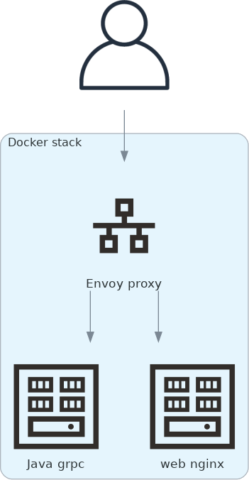

# Cloud Tycoon

A full stack web client to distributed cloud deployed example application masquerading as a game. Touches on the following technologies, tools and services:

**Implementation**
- ECMAScript web browser front-end
- JavaScript SVG rendering and UI
- Java gRPC back-end

**Infrastructure & communication**
- Envoy proxy
- grpc-web transport
- Protocol Buffers message and gRPC service

**Build & Test**
- Bazel build
- NPM transpiling and Rollup
- Java tests
- Mocha JavaScript tests

**Orchestration**
- Docker containerization
- Ansible provisioning
- Kubernetes orchestration

**Cloud**
- Amazon AWS EC2
- Azure Cloud Services
- Google Cloud Platform (GCP)

## Architecture

In its simplest form, the app runs on a Docker stack (locally or on a cloud instance) of three containers. The Envoy proxy takes all incoming requests and routes based on type and endpoint to either the static Nginx web server or the Java gRPC server.

## Requirements

The following requirements and limitations exists:

- Latest Debian or Ubuntu OS version.
- Python 3.11 (known issue in 3.12)
- Bazel 7 (or latest)
- Specific Bazel library dependencies (see [WORKSPACE](WORKSPACE))
- Plain /tmp directory (or use `--noincompatible_sandbox_hermetic_tmp` with bazel)

## Running

TODO
