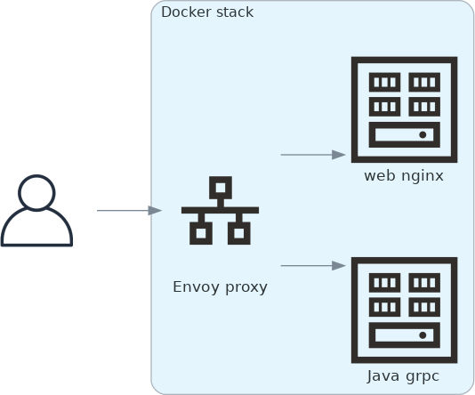

# Cloud Tycoon

A full stack web client to distributed cloud deployed example application masquerading as a game. Touches on the following technologies, tools and services:

- ECMAScript web browser front-end
- JavaScript SVG rendering and UI
- Java gRPC back-end
- Envoy proxy
- grpc-web transport
- Protocol Buffers message and gRPC service
- Bazel build
- Java tests
- Mocha JavaScript tests
- NPM transpiling and Rollup
- Docker containerization
- Kubernetes orchestration
- Amazon AWS EC2
- Azure Cloud Services

## Architecture

TODO

## Requirements

The following requirements and limitations exists:

- Latest Debian or Ubuntu OS version.
- Python 3.11 (known issue in 3.12)
- Bazel 7 (or latest)
- Specific Bazel library dependencies (see [WORKSPACE](WORKSPACE))
- Plain /tmp directory (or use `--noincompatible_sandbox_hermetic_tmp` with bazel)

## Running

TODO
